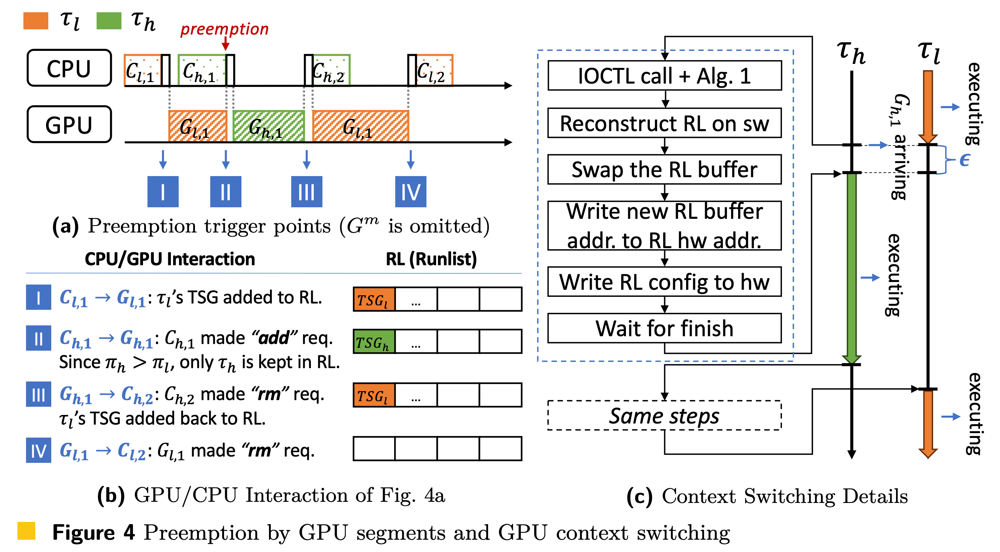

# GCAPS: GPU Context-Aware Preemptive Scheduling Approach

## Publications
This repository includes the source code of our paper ["GCAPS: GPU Context-Aware Preemptive Priority-based Scheduling for Real-Time Tasks."](files/ecrts24_gcaps_paper.pdf)



The description of this scheduling approach can be found in the following paper in ECRTS 2024:
* Yidi Wang, Cong Liu, Daniel Wong, and Hyoseung Kim. GCAPS: GPU Context-Aware Preemptive Priority-based Scheduling for Real-Time Tasks. In Euromicro Conference on Real-Time Systems (ECRTS), 2024.

### Cite Our Paper :blush:
```
@INPROCEEDINGS {wang2024gcaps,
author = {Y. Wang and C. Liu and D. Wong and H. Kim},
booktitle = {2024 Euromicro Conference on Real-Time Systems (ECRTS)},
title = {GCAPS: GPU Context-Aware Preemptive Priority-based Scheduling for Real-Time Tasks},
year = {2024},
volume = {},
issn = {},
keywords = {Real-time systems; GPU scheduling},
}
```

## Contents
- **Theoretical Analysis**
    - [Schedulability test](analysis/readme.md)

- **System Implementation** (:exclamation: Please deploy the driver code first, and run the userspace code next)
    - [GCAPS driver implementation](gcaps_driver_patch/readme.md)
    - [GCAPS userspace implementation & case study](gcaps_userspace/readme.md)

